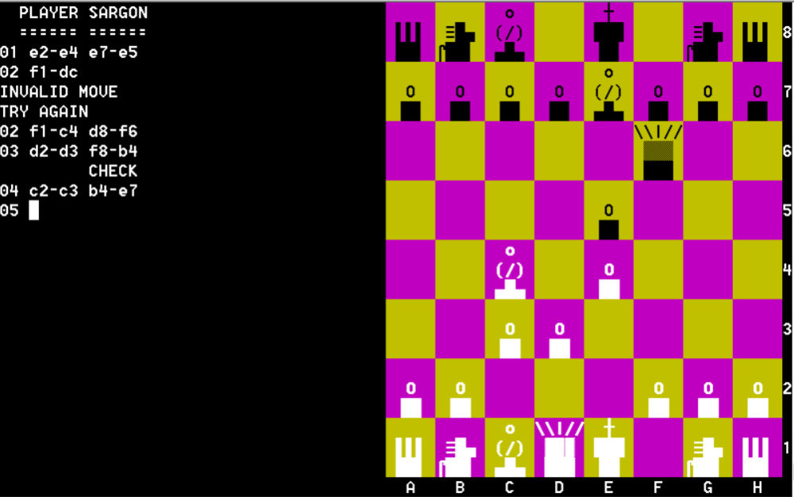
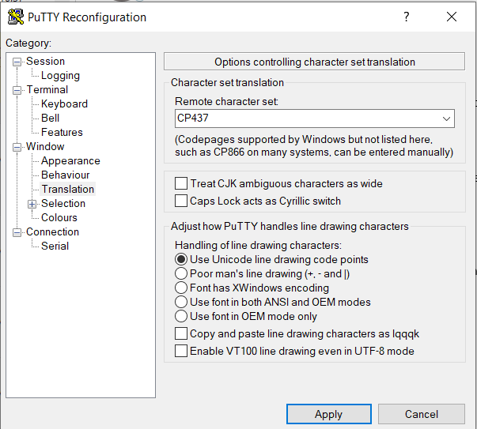

# sargon-cpm
Sargon Chess for CP/M

I found the source code to Sargon Chess from https://github.com/billforsternz/retro-sargon/blob/master/stages/sargon-z80.asm
Sadly it is specific to a certain computer system, but I want it to run under CP/M.
Yes, I know there is already a CP/M version of Sargon 2.1, but it is a poor one graphically. I wanted to make one with better graphics.
So, this is my attempt at it.

It turns out that this is Sargon version 1 rather than the (presumably better?) version 2.1 that is already available elsewhere. I have called it Sargon78 because of the Copyright message in the source, stating that it was written in 1978.

I have improved the graphics, aiming them at a VT100 terminal with ANSI color. It works fine in TeraTerm. If you are using Putty, make sure you set Code Page 437 and Unicode line drawing, and select a font such as Lucida Console:

I hope you like it!

If you are running CP/M v2.2 and have a VT100 terminal then grab SARGON78.COM and start playing!

